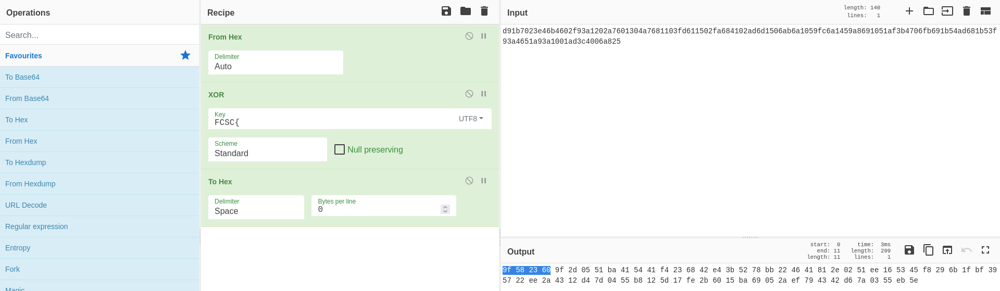
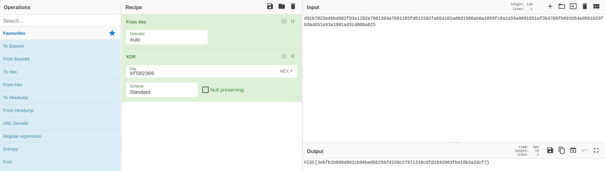

# Clair connu

## Enoncé

Votre but est de déchiffrer le flag.

    Le flag est au format : FCSC{<flag>}

`clair-connu.py`
```python
import os
from Crypto.Util.number import long_to_bytes
from Crypto.Util.strxor import strxor

FLAG = open("flag.txt", "rb").read()

key = os.urandom(4) * 20
c = strxor(FLAG, key[:len(FLAG)])
print(c.hex())
```

`output.txt`
```
d91b7023e46b4602f93a1202a7601304a7681103fd611502fa684102ad6d1506ab6a1059fc6a1459a8691051af3b4706fb691b54ad681b53f93a4651a93a1001ad3c4006a825
```

## Solution

Ce challenge vient de la plateforme [hackropole](https://hackropole.fr/fr/challenges/crypto/fcsc2021-crypto-clair-connu/).

En se basant sur l'énoncé, nous comprenons qu'il faut qu'on utilise une attaque par [clair connu](https://fr.wikipedia.org/wiki/Attaque_%C3%A0_texte_clair_connu). Elle consiste à déterminer, dans notre cas, la clé de déchiffrement du chiffré, en utilisant une partie du message clair, ici `FCSC{`.

### Analyse de l'algorithme de chiffrement

Commençons d'abord par comprendre comment le message est chiffré en étudiant `clair-connu.py`.

On importe des librairies.
```python
import os
from Crypto.Util.number import long_to_bytes
from Crypto.Util.strxor import strxor
```

On lie le flag dans le fichier correspondant pour le stocker dans `FLAG`.
```python
FLAG = open("flag.txt", "rb").read()
```

On génère une clé aléatoirement de 4 octets répétés 20 fois.
```python
key = os.urandom(4) * 20
```

C'est à dire qu'on commence par générer 4 octects aléatoirement.

> Par exemple \\xde\\xad\\xbe\\xef

Puis on le répète 20 fois.

> \\xde\\xad\\xbe\\xef\\xde\\xad\\xbe\\xef\\xde\\xad\\xbe\\xef[...]\\xde\\xad\\xbe\\xef

On chiffre le flag via du XOR avec la clé tronquée à la longueur du flag puis on affiche le résultat sous forme de données hexadécimales.
```python
c = strxor(FLAG, key[:len(FLAG)])
print(c.hex())
```

### Récupération de la clé

Maintenant que nous savons comment est chiffré le flag, nous pouvons tenter de récupérer la clé.

L'algorithme de chiffrement est donc un simple [XOR](https://fr.wikipedia.org/wiki/Fonction_OU_exclusif). En se basant sur les propriétés de cette opération nous pouvons récupérer la clé grâce au clair connu.

En effet, $key \oplus flag \oplus flag = key$.

Nous obtenons donc
```python
from operator import xor
>>> print(hex(xor(0xd9, ord('F'))))
0x9f
>>> print(hex(xor(0x1b, ord('C'))))
0x58
>>> print(hex(xor(0x70, ord('S'))))
0x23
>>> print(hex(xor(0x23, ord('C'))))
0x60
```



```
9f582360
```

### Récupération du flag

A partir de là, il est possible d'écrire un petit script pour déchiffrer le flag ou bien d'utiliser d'autres ressources comme [cyberchef](https://cyberchef.io).



```
FCSC{3ebfb1b880d802cb96be0bb256f4239c27971310cdfd1842083fbe16b3a2dcf7}
```