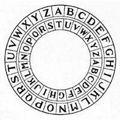
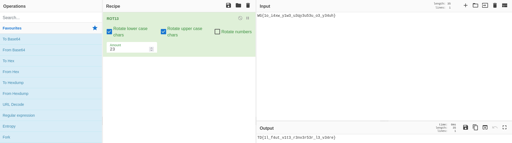

# CryptoCésar

## Enoncé

On vient d'intercepter un message, déchiffrer le pour valider ce challenge

`WG{1o_i4xw_y1w3_u3qy3u53u_o3_y34uh}`

Il s'agit d'un message chiffré, mais on ne sait pas comment le déchiffrer. Peut-être que vous pourrez nous aider

## Solution

D'après le nom du challenge, le message chiffré aurait un lien avec [César](https://fr.wikipedia.org/wiki/Jules_C%C3%A9sar). En cherchant `cesar cryptographie` nous tombons sur [le chiffrement par décalage](https://fr.wikipedia.org/wiki/Chiffrement_par_d%C3%A9calage). Ce type de chiffrement consiste à remplacer chaque lettre de l'alphabet du message en clair, par une autre lettre à distance fixe correspondant à la clé de (dé)chiffrement.
> Ici la clé pour chiffrer et déchiffrer le message est la même. On parle alors de [cryptographie symétrique](https://fr.wikipedia.org/wiki/Cryptographie_sym%C3%A9trique)



Par exemple, si nous choisissons de prendre pour clé `3`, chaque `A` deviendra `D`, le `B` deviendra `E` et ainsi de suite.

En utilisant [cyberchef](https://cyberchef.io) avec l'opération `ROT13` et en jouant sur le nombre de décalage, nous retrouvons le flag: 
```
TD{1l_f4ut_v1t3_r3nv3r53r_l3_v34re}
```

