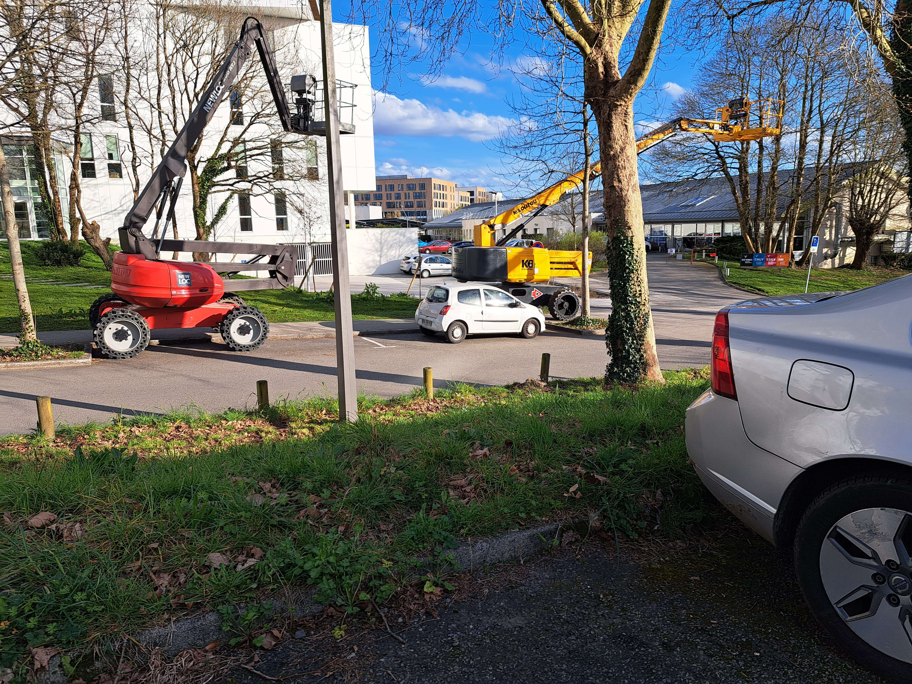
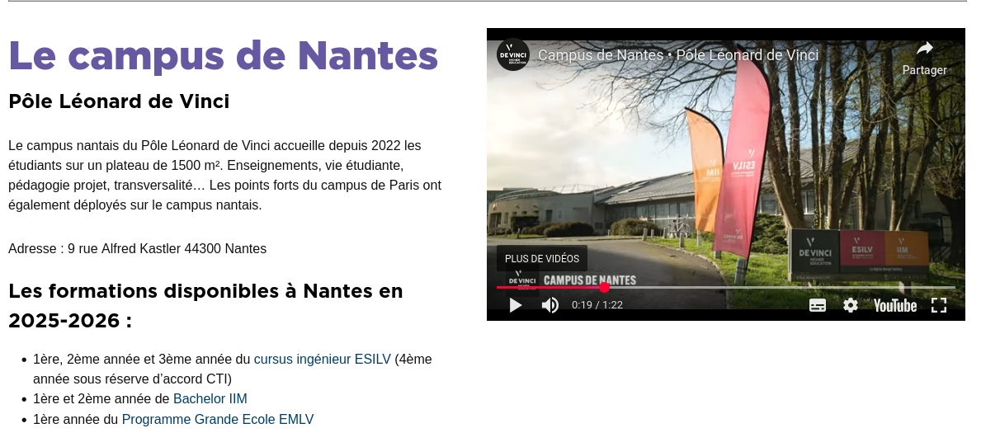
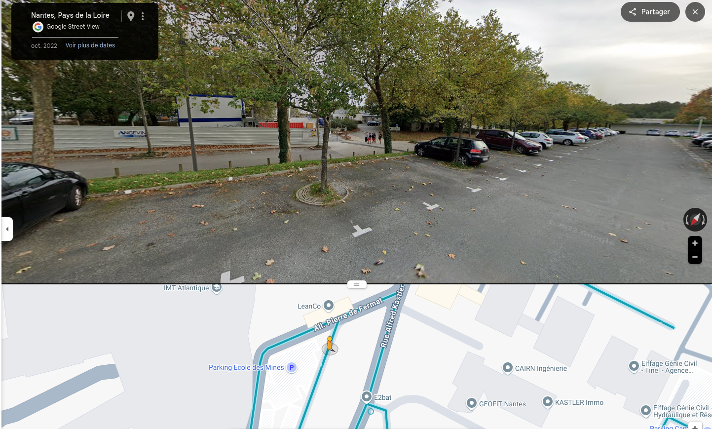

# Where I Am

## Enoncé

Utilise tes talents de GEOINT pour trouver la rue la plus proche d'où a été prise cette photo.

    Le format du flag est : TD{nom_de_la_rue} Il ne doit pas y avoir de "rue" et les espaces doivent être remplacés par un "_"



## Solution

Les moteurs de recherche inversée comme [google images](https://images.google.fr/)


ne donnant pas de résultat probant, nous devons rechercher des indices, comme des panneaux ou des batiments, dans la photo.

Sur la droite de l'image, nous pouvons remarquer un panneau intéressant.


La photo a été prise proche de ce qui semble être une école supérieure.

Après recherche sur `ecole de vinci`, nous tombons rapidement sur [le site de vinci](https://www.devinci.fr/).

Puis en regardant [les campus](https://www.devinci.fr/le-pole/les-campus/), nous remarquons rapidement qu'il s'agit du campus de Nantes.



[recherche google maps](https://www.google.fr/maps/place/ESILV+Nantes/@47.2812389,-1.5220407,17z/data=!4m6!3m5!1s0x4805efa27320b641:0xa4d5e3d59f13aae9!8m2!3d47.2812389!4d-1.5194658!16s%2Fg%2F11tb5rptwz?entry=ttu&g_ep=EgoyMDI1MDUyNy4wIKXMDSoASAFQAw%3D%3D)

Et bingo.



```
TD{alfred_kastler}
```